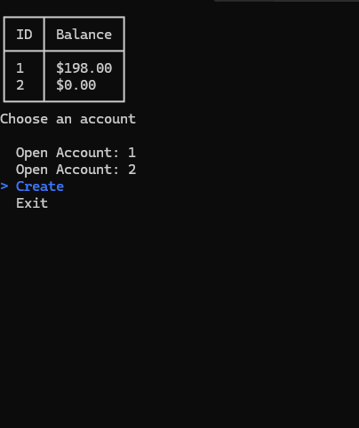
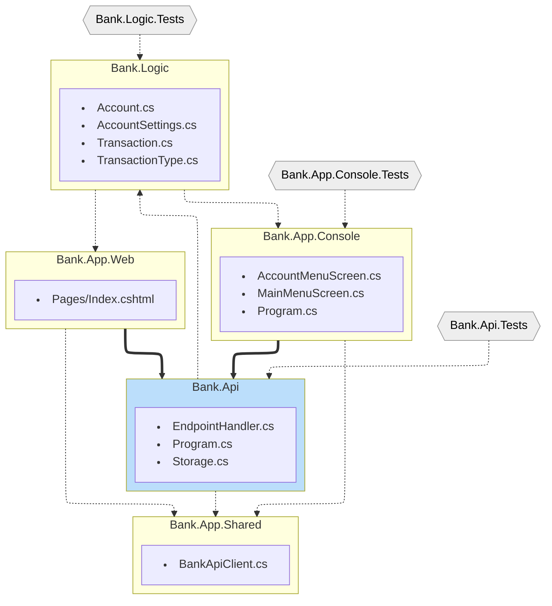
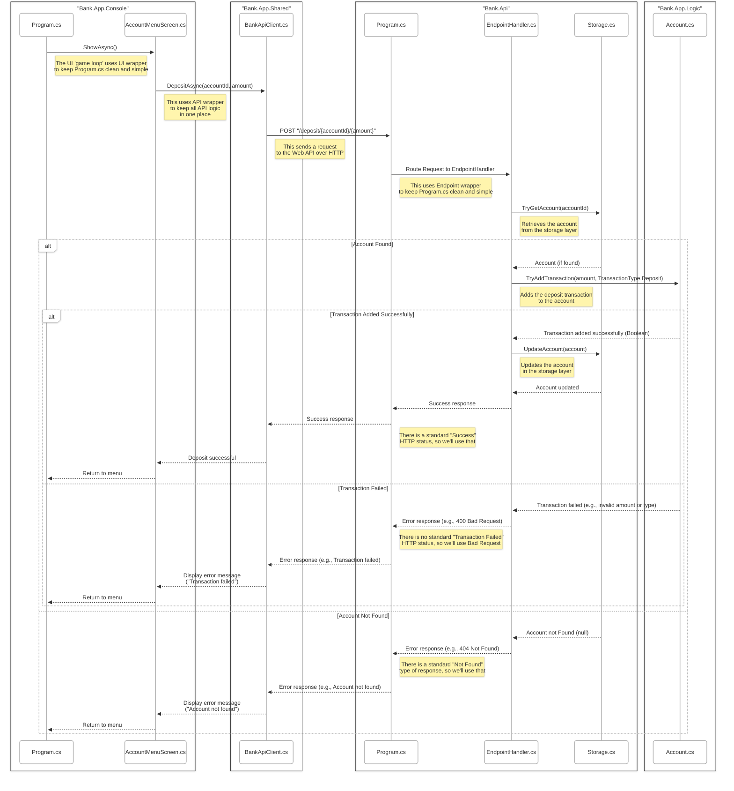
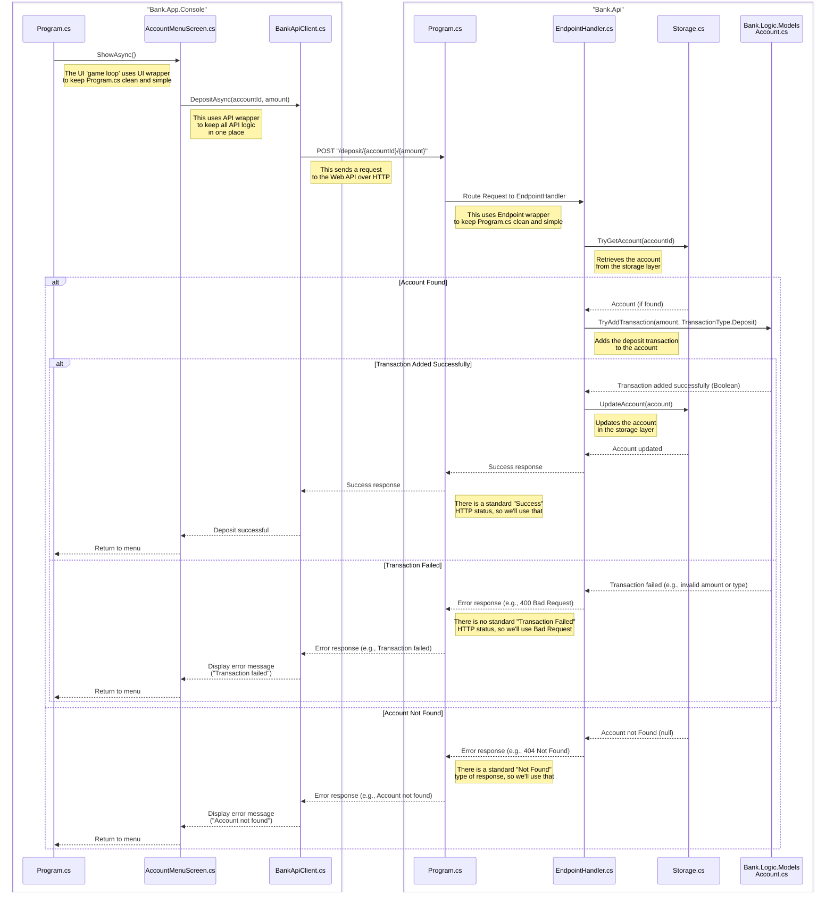

# Assignment 12

I have created the Console version of the UI. You are going to create the Web version of the UI. The functionality needs to be the same - create accounts, list accounts, deposit and withdraw, etc. The colors and tables in the Console are accomplished by the NuGet package `Spectre` which was created to make Console apps nice - doing much of the hard work we did in the early weeks of class. There is no requirement that the Console and the Web apps look alike, just that they behave alike. Here's a walkthrough of the Console functionality.

## Code Walkthrough

### Projects and how they relate

As we discussed in class, we have several projects in this solution. Each has only a few classes, dedicated to the purpose of the project. For example, the `Bank.Api` project (the Web API) is the central project used by both our Console and Web projects. Those Client projects are only "coupled" to the Web API project over HTTP, that is, when they call to one of the Web API endpoints. Conversely, the Web API can never call the Console or Web projects as a Web API can only listen for requests it receives. The `Bank.Api` project (the Web API) uses the code in `Bank.Logic`. Look closely, the Console and Web projects also use the code in the `Bank.Logic` project. These references are simple project references.  

### Sequence: Get a List of Accounts

As we discussed in class, a sequence diagram shows you how the flow of code works across different classes. In this case, we start in the Bank.App.Console project and invoke the operation to get a list of accounts. This operation flows through the MainMenuScreen and BankApiClient in the console project, makes an HTTP request to the Bank.Api project, and is routed to the EndpointHandler. The EndpointHandler interacts with the Storage layer to retrieve the accounts, which are deserialized from the JSON file using the Account model. The data is then returned back through the layers to be displayed in the console.

### Sequence: Add a Deposit to an Account

Here's another sequence diagram. It's the only other one I will make, but this helps demonstrate simple and somewhat complex operations. Here, we again start in the Bank.App.Console project and invoke the operation to add a deposit to an account. This operation flows through the AccountMenuScreen and BankApiClient in the console project, makes an HTTP POST request to the Bank.Api project, and is routed to the EndpointHandler. The EndpointHandler retrieves the account from the Storage layer, validates the transaction using the Account model, and updates the account with the new transaction. The updated account is then saved back to the Storage layer, and returned. This sequence diagram is special because it includes ALT sections. These show you what might happen depending on the result. In this case one case is Success while another is when the Account is not found or the Deposit Transaction fails. 

## Universal Acceptance Criteria

1. You must understand every single line of your solution.
2. Your code must compile and run without errors.
3. You must submit your repository URL in Brightspace.

## Assignment Requirements

1. Copy the `Console App` into a `Web App`. 

    1. Use the minimal Razor Pages web UI called `Bank.App.Web`.

2. Ensure basic functionality (at least):

_Use the Console as reference._

    - List Accounts
        - List Accounts with Balances
        - Select & View an Account
        - Create a New Account
    - View Account
        - Always Show: Name & Balance
        - Allow Deposit
            - Ask Dollar Value
        - Allow Withdraw
            - Ask Dollar Value
        - Allow Delete Account
            - Prompt the user: "Are you sure?"
        - View All Transactions
            - Show Table of Transactions
        - Delete Account

## Optional Bonus (40 points)

1. Add `Nickname` to `Account.cs`
2. Allow user to edit `Nickname` in Web
3. Provide a Sequence diagram of the operation.

**Good luck.**
